---

 

---

## whoami

> I turn messy, real-world data into clean pipelines, sharp models, and dashboards that actually get used.
> From 1M+ row ETL workflows to Power BI dashboards adopted in production — I close the gap between analysis and action.

## 🛠️ Languages & Tools I Have Placed My Hands On

---

## 🚀 Best Repositories

<table>
<tr>
<td width="50%" valign="top">

<table width="100%">
<tr>
<td colspan="2" style="background:#8a5cf6; padding:10px 14px;">

**🛍️ Retail Sales Forecasting & Demand Planning**

*1M+ records · 43 countries · 4,735 products*

</td>
</tr>
<tr>
<td width="50%" valign="top">

**74.5%**
SARIMA accuracy

**843**
Champion customers

</td>
<td width="50%" valign="top">

**£5,689**
avg spend

**40%**
faster queries

</td>
</tr>
<tr>
<td colspan="2">

</td>
</tr>
</table>

</td>
<td width="50%" valign="top">

<table width="100%">
<tr>
<td colspan="2" style="background:#e85cb8; padding:10px 14px;">

**🌆 Global City Traffic Intelligence Platform**

*5 cities · 50+ road corridors · Real-time API pipeline*

</td>
</tr>
<tr>
<td width="50%" valign="top">

**15+**
engineered features

**4**
dimension tables

</td>
<td width="50%" valign="top">

**40%**
faster queries

**<10%**
MAPE (target)

</td>
</tr>
<tr>
<td colspan="2">

</td>
</tr>
</table>

</td>
</tr>
</table>

---

## ⚙️ Tech Stack

**🤖 AI / ML / Forecasting**

**📊 BI & Visualization**

**🗄️ Databases & Warehousing**

**🔧 Tools**

---

## 📊 GitHub Stats

  

---

## 👾 Contribution Arcade

---
## 🔥 Currently Working On

---

  

